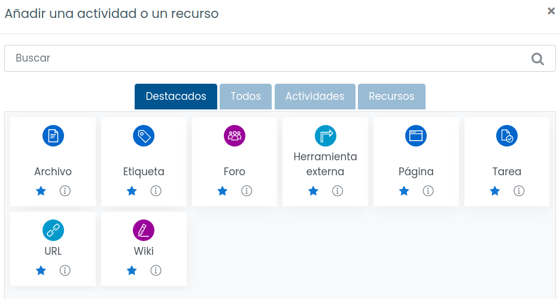
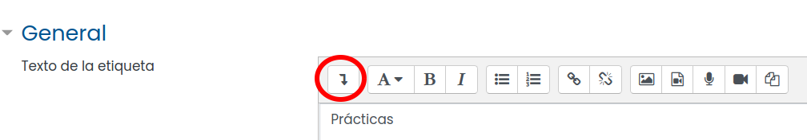
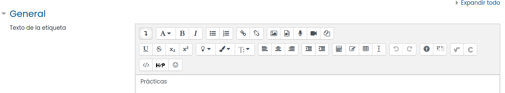
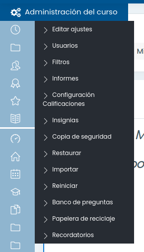
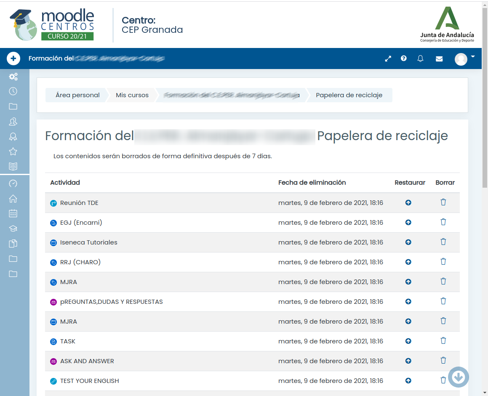

# Creación de contenido

Necesitamos un rol que nos permite crear/modificar contenido

* Activamos Edición y nos aparecen nuevas opciones

* Todo lo que tiene un "lápiz" podemos modificarlo
* Todo lo que tiene "Editar" o un "engranaje" se puede configurar
* La "cruz con flechitas" permite mover contenido entre secciones o de orden
* Algunos roles podrán editar el formato del curso
* Pulsando "Añadir una nueva actividad o recurso" podremos añadir

    Las más frecuentes:
    * Archivo: subimos (alojamos) un fichero a la plataforma. Muy útil para evitar que se pueda perder un enlace
    * Etiqueta: texto corto para identificar/separar contenido
    * Foro: para comunicarnos
    * Herramienta externa: un software de 3º que integramos. Por ejemplo la videoconferencia
    * Página: una nueva página para añadir texto, imágenes. Muy útil para estructuras los contenidos
    * Tarea: Para hacer entregas
    * URL: enlace a contenido externo
    * Wiki: página donde los usuarios pueden añadir contenido.
    
Cuando editamos contenido, por defecto vemos las herramientas de edición básicas: tipo de texto (cabecera, texto, ...), negrita, enlace, imagen,..

Si queremos usar más opciones como por ejemplo cambio de colo o editores más complejos (como el de ecuaciones), podemos hacer que se muestren las barras de herramientas expandidas  Pulsando el primer botón

## Borrado -> a la papelera

Si por error borramos algunos contenidos, podemos recuperarlos desde la papelera. Accedemos desde el menú lateral de ajustes

Veremos los ficheros borradas hace menos de 7 días

Pulsamos sobre el incono de la flecha para restaurar cada fichero

Si queremos borrarlo definitivamente pulsaremos sobre la papelera y **ya no podremos recuperarlo**

Lo componentes recuperados volerán a aparecer en el lugar que estuvieran, salvo que se haya borrado la pestaña o el tema el que estuvieran que saldrán el primer tema o pestaña.

## Movimiento de recursos/actividades

Al activar la edición, aparecerá un icono con forma de cruz de flechas con el que podremos mover los recursos/actividades entre los componentes de la página.

Si tenemos activada la visualización con pestañas, podemos mover elementos entre ellos activando la opción "Acciones de edición asíncronas" de las "Utilidades de edición de pestañas"

