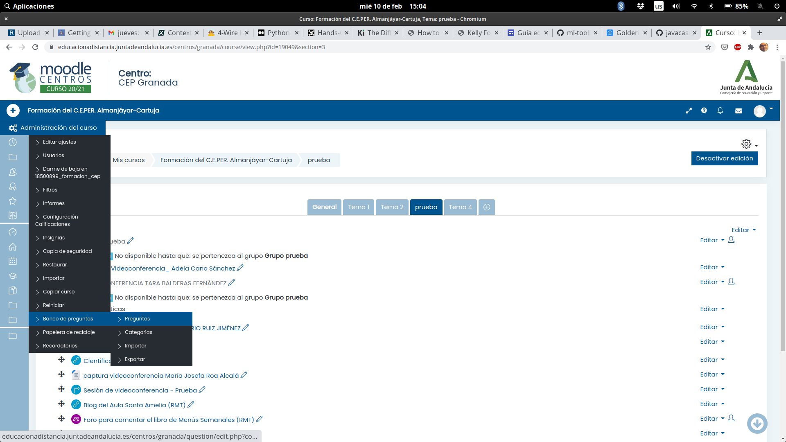
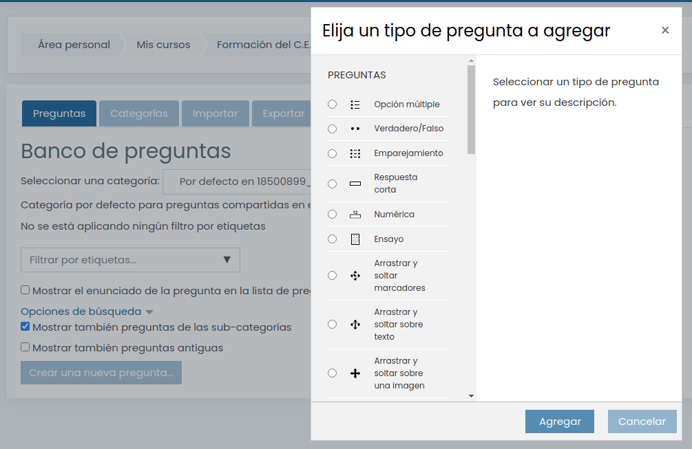

# Cuestionarios y Preguntas

Un cuestionario es la realización de un conjunto de preguntas que se hace para determinados participantes en un momento determinado

## Cuestionario

* Fecha inicio
* Duración
* Reintentos
* Aleatorización del orden
* Selecciona de preguntas aleatorias
* Calificación
*...
## Banco de preguntas   

Las preguntas se almacenan en bancos de preguntas que permiten su reutilización, donde podemos organizarlas en categorías

## Tipo de preguntas

## Importación y exportación de preguntas