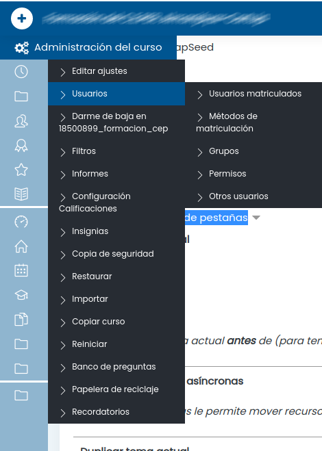
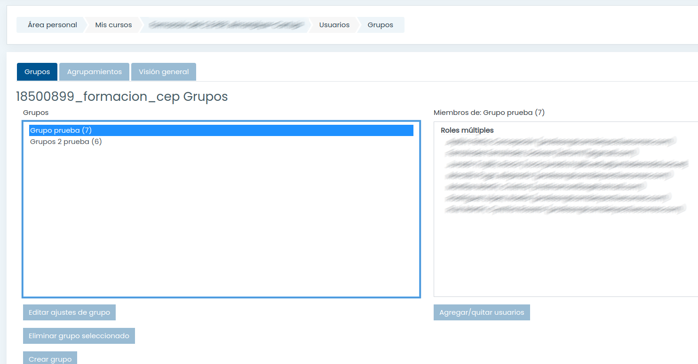
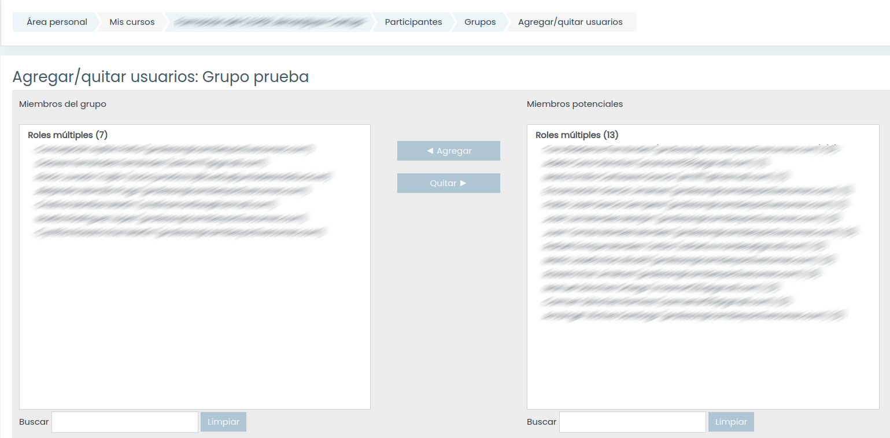

# Grupos

Podemos definir grupos de participantes, lo que nos permitirá simplificar las restricciones que aplicaremos a los listintos recursos/actividades

Accedemos desdel menú Participantes -> Grupos

Donde veremos los grupos ya creados, con sus correspondientes participantes.

Desde aquí podemos editarlos añadiendo o quitanto integrantes.

