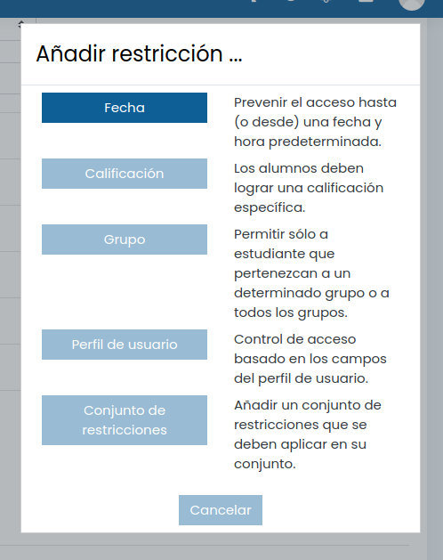
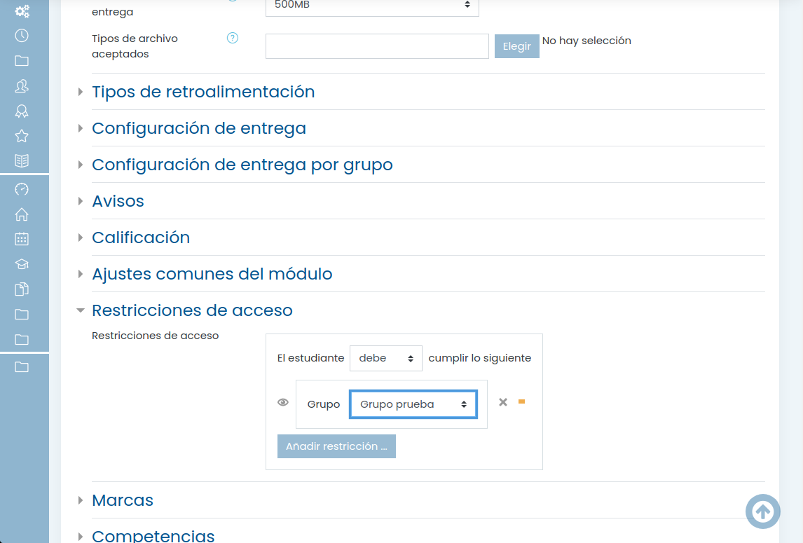
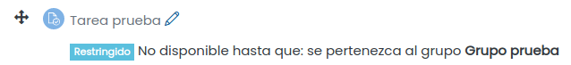

# Restricciones

Podemos añadir restriccionas a cualquier recurso/actividad de manera no estén disponibles dependiendo de ciertas condiciones:
* Por grupos
* Por participantes
* Por fecha 
* Por calificaciones
* Un conjunto de varias restricciones

Dentro de las propiedades de cada recurso, en el apartado Restricciones podemos establecerlas con las condiones seleccionadas

Veremos los recursos/activiades con restricciones con una indicación de las mismas

