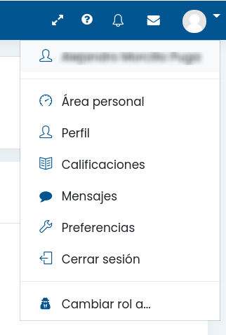

## Roles

Dentro de moodle cada usuario de moodle puede tener diferentes roles, entre los que hay una jerarquía, y cada nivel incluye a todos los que tiene por abajo y por tanto tiene todas esas capacidades.

* Administrador: lo puede hacer todo
* Gestor: Puede crear cursos y matriculaciones
* Editor: Puede editar cursos
* Profesor con corrección: Puede corregir las tareas
* Estudiante: entrega las tareas

Un usuario puede elegir con qué rol ve un curso. Para ello puede elegir entre ellos 

Cuando creamos contenido en un curso es conveniente que lo veamos al menos con el rol de estudiante para combrobar que todo se ve como debiera.